# 🤖 From Prompt to Analysis Dashboard | Power BI + Claude AI + MCP


What if you could build a complete Power BI project just by talking to AI? This project does exactly that. **Claude Desktop** connects to Power BI via **MCP Protocol** and takes natural language commands, creating tables, relationships, DAX measures, and dashboard blueprints automatically. No manual DAX writing. No manual relationship building. Just plain English.

---

## 🧠 How It Works

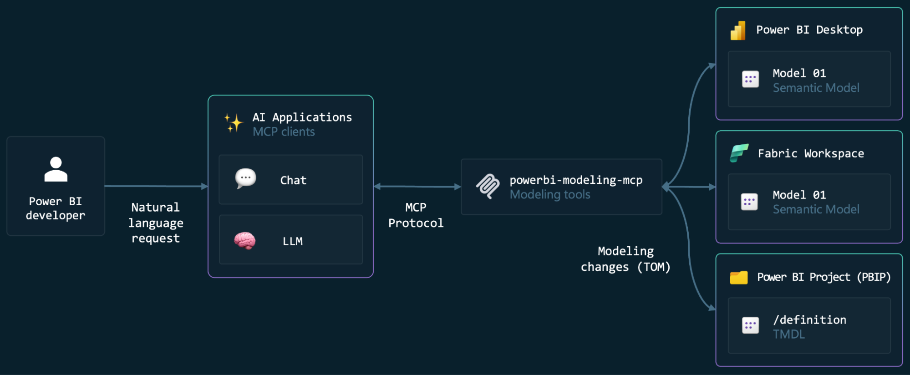

Claude Desktop connects to Power BI Desktop through the **powerbi-modeling-mcp** server installed as a VS Code extension. This creates a bridge where Claude can read and modify the Power BI semantic model directly using natural language creating tables, relationships, DAX measures, and more all through the **MCP Protocol**.

```
You (natural language) → Claude Desktop → MCP Protocol → powerbi-modeling-mcp → Power BI Desktop
```

---

## 🗃️ Dataset Food Delivery Orders

This project is built on a **food delivery business dataset** with a star schema:

| Table | Type | Description |
|-------|------|-------------|
| `fact_orders` | Fact | Order records date_id, food_id, location_id, order_id, price, rating, rating_count, restaurant_id |
| `dim_date` | Dimension | Date dimension with order_date |
| `dim_dish` | Dimension | Food items dish_id, dish_name, category |
| `dim_restaurant` | Dimension | Restaurant info restaurant_id, restaurant_name |
| `dim_location` | Dimension | Location info location_id, city, state |

---

## 🛠️ Setup How to Connect Claude + Power BI

### Prerequisites
- Claude Desktop installed
- VS Code installed
- Power BI Desktop installed

### Step 1 Install the Power BI MCP Extension in VS Code
- Open VS Code
- Search for **"powerbi-modeling-mcp"** in Extensions
- Install it

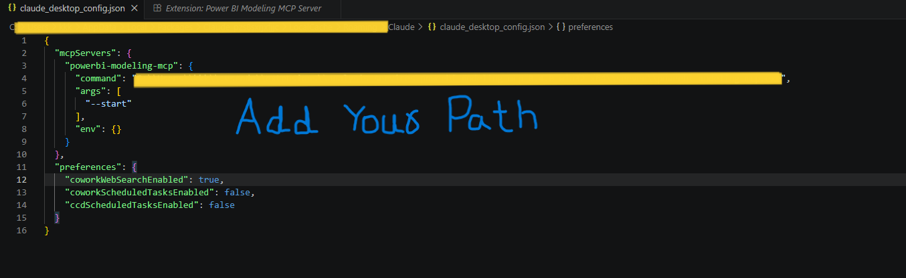

### Step 2 Configure Claude Desktop MCP Server
- Open Claude Desktop → Settings → Developer
- Click **Edit Config**
- Add the powerbi-modeling-mcp server pointing to the extension executable

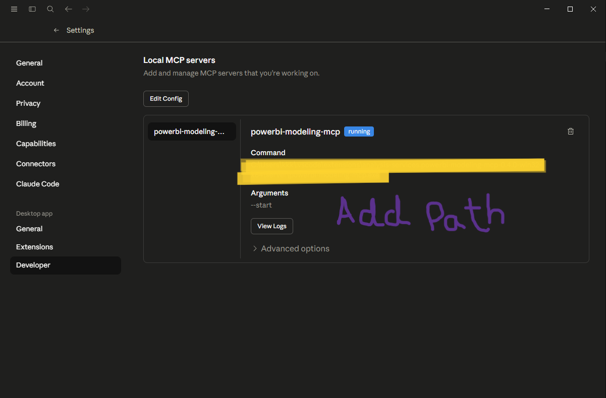

The server will show **"running"** status when connected successfully.

### Step 3 Open Your Power BI File
- Create a Power BI file, load all dataset tables, and save it
- Keep Power BI Desktop open in the background
- Claude will connect to it via the MCP server

---

## 🚀 Complete Workflow — 8 Prompts to Full Dashboard

### ✅ Prompt 1 List Available Datasets

```
List all available datasets or models from the Power BI modeling MCP server
```

Claude scans the MCP server and lists all connected Power BI models available.

---

### ✅ Prompt 2 Connect to the Power BI File

```
connect to the power bi file [Your File Name.pbix]
```

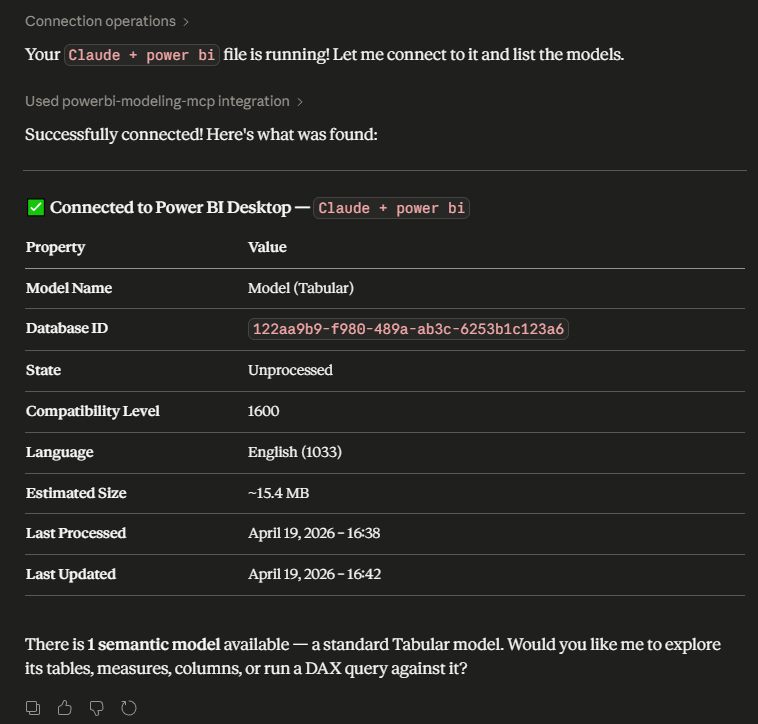

Claude connects directly to your open Power BI file through the MCP server, establishing a live two-way connection to the semantic model.

---

### ✅ Prompt 3 Create a Date Table

```
create a date table from order date field from dim date table.
Also create all the required date related columns inside the date table.
```

***Claude AI:***

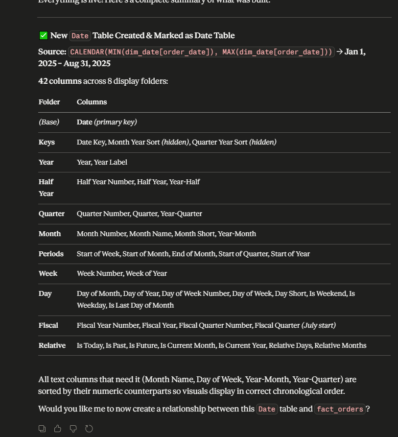

***Power Bi:***

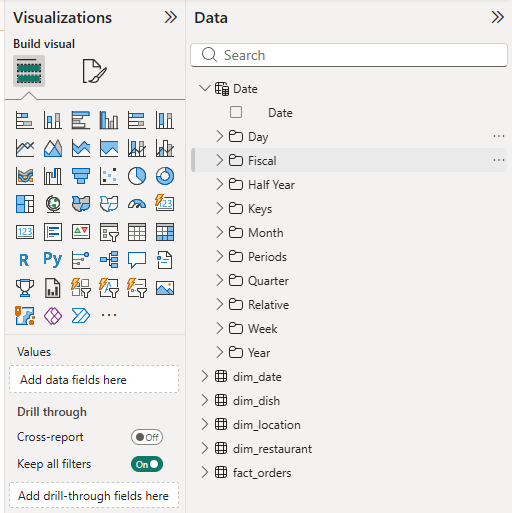

**What Claude built automatically — 10 columns created by AI:**

| # | Column Created |
|---|---------------|
| 1 | Date |
| 2 | Date Key |
| 3 | Day of Month |
| 4 | Day of Week |
| 5 | Day of Week Number |
| 6 | Month |
| 7 | Month Name |
| 8 | Quarter |
| 9 | Year |
| 10 | Is Weekend |

---

### ✅ Prompt 4 Build the Data Model & Relationships

```
create a data model from the tables I have in power bi [File Name].
Create relationships.
```

***Claude AI:***

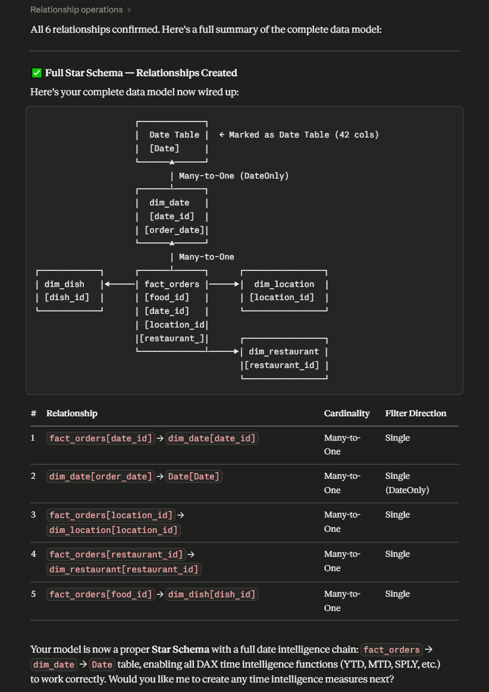

***Power Bi:***

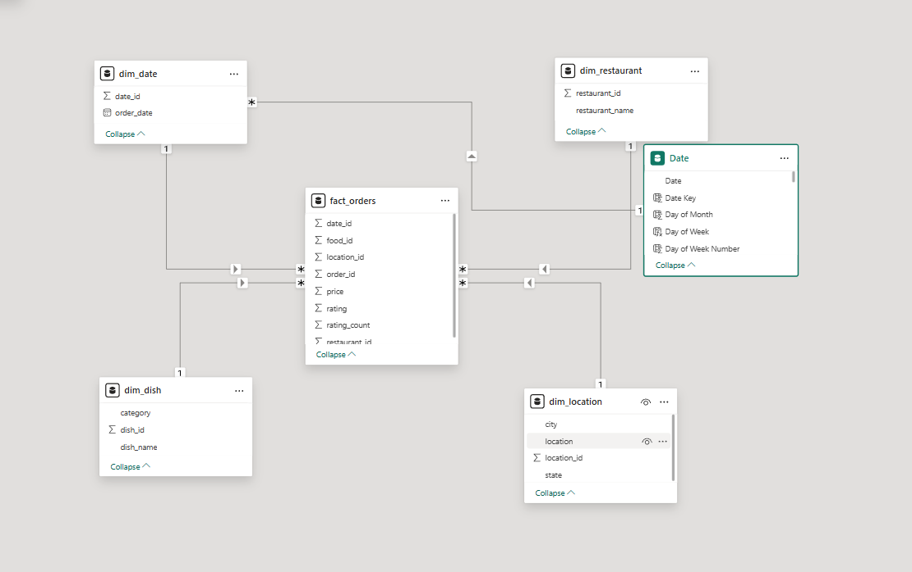

**Claude automatically detected and created all relationships:**
- `fact_orders[date_id]` → `dim_date[date_id]` (Many-to-One)
- `fact_orders[food_id]` → `dim_dish[dish_id]` (Many-to-One)
- `fact_orders[restaurant_id]` → `dim_restaurant[restaurant_id]` (Many-to-One)
- `fact_orders[location_id]` → `dim_location[location_id]` (Many-to-One)
- `fact_orders[date_id]` → `Date[Date Key]` (Many-to-One)

All relationships were created perfectly with correct cardinality no manual dragging needed.

---

### ✅ Prompt 5 Create All KPI Measures

```
please create dax measures for all the possible KPIs from the data we have
```

***Claude AI:***

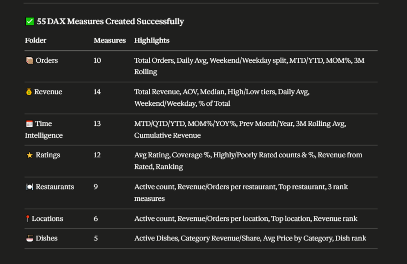

***Power Bi:***

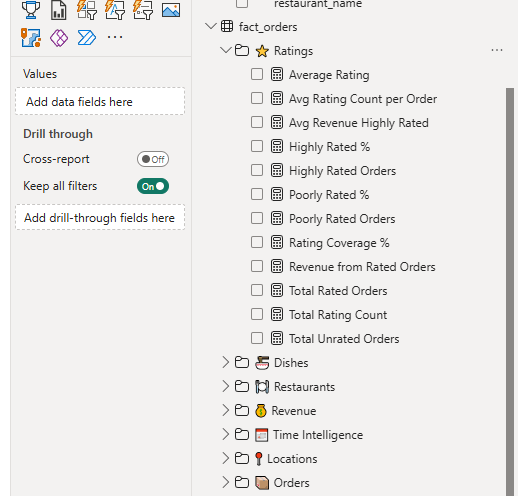

**Claude created a full library of 55 DAX measures organized by category — all from one prompt:**

| Category | Count | Highlights |
|----------|-------|-----------|
| 📦 **Orders** | 10 | Total Orders, Daily Avg, Weekend/Weekday split, MTD/YTD, MOM%, 3M Rolling |
| 💰 **Revenue** | 14 | Total Revenue, AOV, Median, High/Low tiers, Daily Avg, Weekend/Weekday, % of Total |
| 📅 **Time Intelligence** | 13 | MTD/QTD/YTD, MOM%/YOY%, Prev Month/Year, 3M Rolling Avg, Cumulative Revenue |
| ⭐ **Ratings** | 12 | Avg Rating, Coverage %, Highly/Poorly Rated counts & %, Revenue from Rated, Ranking |
| 🏪 **Restaurants** | 9 | Active count, Revenue/Orders per restaurant, Top restaurant, 3 rank measures |
| 📍 **Locations** | 6 | Active count, Revenue/Orders per location, Top location, Revenue rank |
| 🍽️ **Dishes** | 5 | Active Dishes, Category Revenue/Share, Avg Price by Category, Dish rank |
| **Total** | **55** | **All created automatically by Claude AI from a single natural language prompt** |

**Test Results from dataset:**
- Total Orders: 197,430
- Weekday Orders: 1,40,018 (70.9%)
- Weekend Orders: 57,412 (29.1%)
- Weekday Revenue: ₹3.75 Cr
- Weekend Revenue: ₹1.55 Cr

Here we tested all KPIs to check whether they are working fine or not.

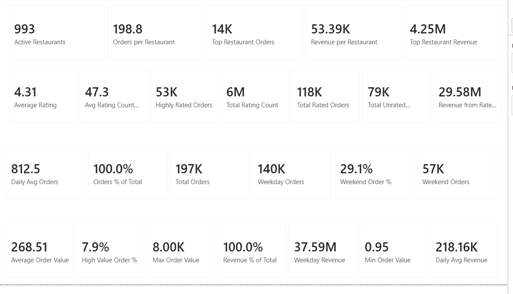

---

### ✅ Prompt 6 — Get Dashboard Ideas from Claude

```
please create a dashboard with some important KPIs and charts which can help business
```

Before building anything in Power BI, we first asked Claude to suggest what KPIs and charts would be most useful for the business. Claude gave us a complete dashboard idea, what to measure, what visuals to use, and what data tells the most important business story.

***Claude AI:***

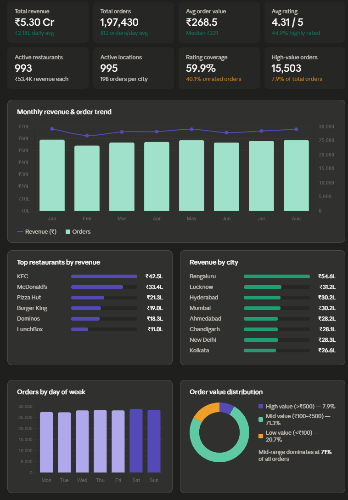
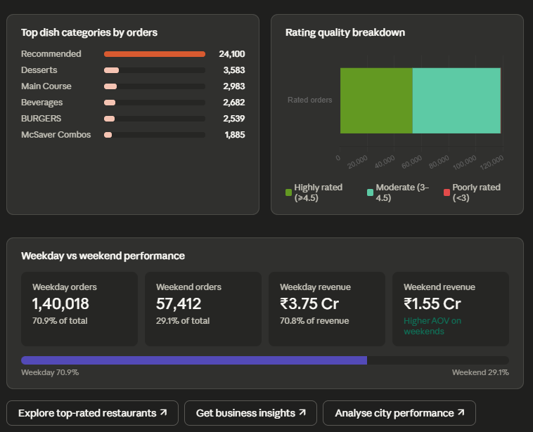

Claude generated a **complete dark-themed HTML dashboard** as the blueprint showing exactly what the Power BI dashboard should look like.

**8 KPI Cards suggested by Claude:**

| KPI | Value |
|-----|-------|
| Total Revenue | ₹5.30 Cr (₹2.18L daily avg) |
| Total Orders | 1,97,430 (812 orders/day avg) |
| Avg Order Value | ₹268.5 (Median ₹221) |
| Avg Rating | 4.31/5 (44.9% highly rated) |
| Active Restaurants | 993 (₹53.4K revenue each) |
| Active Locations | 995 (198 orders per city) |
| Rating Coverage | 59.9% (40.1% unrated orders) |
| High-Value Orders | 15,503 (7.9% of total orders) |

**5 Charts suggested by Claude:**
- Monthly Revenue & Order Trend (dual-axis bar + line chart — Jan to Aug)
- Top Restaurants by Revenue (KFC ₹42.5L, McDonald's ₹33.4L, Pizza Hut ₹21.3L, Burger King ₹19.0L, Dominos ₹18.3L, LunchBox ₹11.0L)
- Revenue by City (Bengaluru ₹54.6L leads, followed by Lucknow, Hyderabad, Mumbai, Ahmedabad)
- Orders by Day of Week (consistent across Mon-Sun, slight dip on weekends)
- Order Value Distribution (High >₹500 = 7.9%, Mid ₹100-₹500 = 71.3%, Low <₹100 = 20.7%)

---

### ✅ Prompt 7 — Try to Build Dashboard Directly Inside Power BI

After getting the dashboard idea, we tried to go one step further and asked Claude to build the dashboard directly inside the Power BI file.

```
i want the dashboard built directly inside my Power BI file, not as HTML.
can you use the Power BI REST API or any available method to create the visuals
directly on my Power BI report page? i have an empty page called "Page 1" ready.
```

**Claude's honest response - The hard truth about Power BI canvas automation:**

Claude explained that there are 3 ways to programmatically create visuals in a .pbix file, and here is the real status of each:

| Method | Status | Reason |
|--------|--------|--------|
| **Power BI REST API** | Not possible locally | Only works on reports published to Power BI Service (powerbi.com). Requires Pro/Premium license and even then only creates basic visuals |
| **Power BI MCP Server** | Not possible for visuals | The MCP server controls only the semantic model layer (tables, measures, relationships). It has no access to the report canvas at all |
| **Direct .pbix file editing** | Not possible | The .pbix format contains a proprietary binary Report/Layout file that Microsoft has never publicly documented. Not editable by external tools |

> This is what makes this project real and honest. We tried, Claude explained exactly why it could not do it, and we found the best available workaround together.

---

### ✅ Prompt 8 — Resize HTML Dashboard to Power BI Canvas Size

Since Claude could not place visuals directly on the Power BI canvas, we asked it to resize the HTML dashboard to match the exact Power BI canvas dimensions so we can use it as a pixel-accurate reference.

```
can you redesign this above html dashboard in the size of power bi canvas?
```

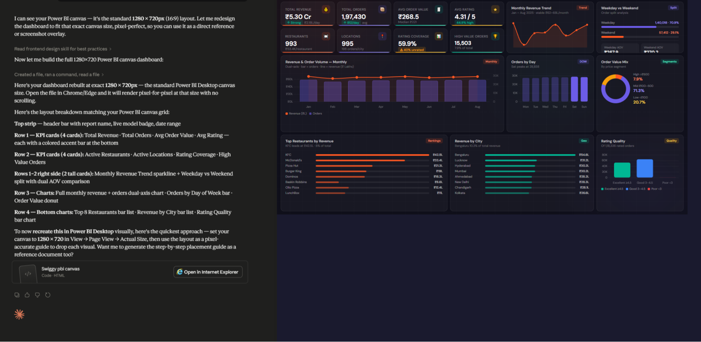

Claude rebuilt the entire dashboard at exact **1280x720px — the standard Power BI Desktop canvas size** pixel-perfect, so it can be used as a direct reference or screenshot overlay when manually recreating in Power BI.

**Layout breakdown Claude followed:**

| Section | Content |
|---------|---------|
| Top strip | Header bar with report name, live model badge, date range |
| Row 1 — KPI cards (4) | Total Revenue, Total Orders, Avg Order Value, Avg Rating — each with colored accent bar |
| Row 2 — KPI cards (4) | Active Restaurants, Active Locations, Rating Coverage, High Value Orders |
| Rows 1-2 right side | Monthly Revenue Trend sparkline + Weekday vs Weekend split with dual AOV comparison |
| Row 3 — Charts | Full monthly revenue + orders dual-axis chart, Orders by Day of Week bar, Order Value donut |
| Row 4 — Bottom charts | Top 8 Restaurants bar list, Revenue by City bar list, Rating Quality bar chart |

---

## 📊 Final Dashboard

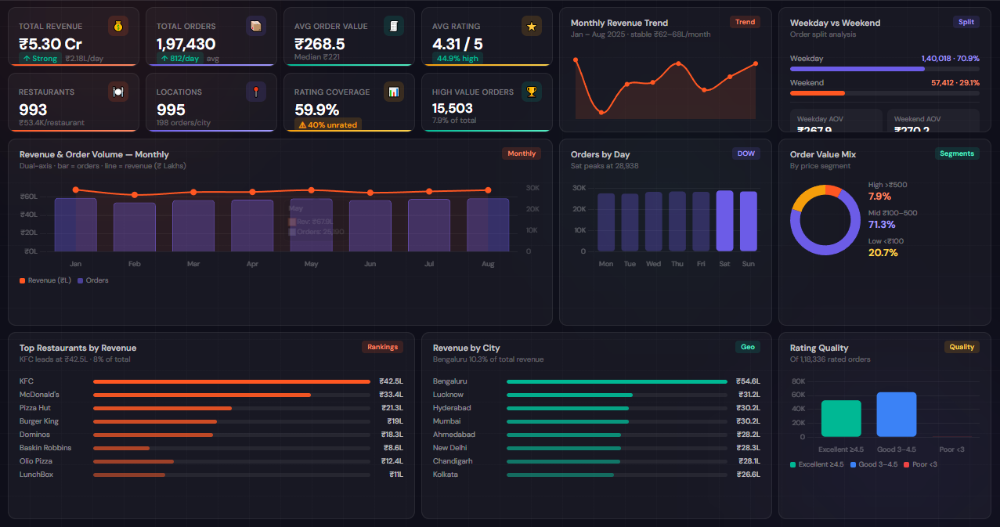

This dashboard was **fully designed by Claude AI** and generated as an HTML file. Since Claude cannot place visuals directly on the Power BI canvas (as explained in Prompt 7), you can use this HTML dashboard in two ways:

1. **Use it as a reference** — Open it in Chrome/Edge at 1280x720 and manually recreate each visual inside Power BI Desktop using the 55 measures Claude already built
2. **Keep refining with Claude** — You can keep giving Claude prompts to update the dashboard. For example: *"change the bar chart to a donut chart"*, *"add a city slicer"*, *"change the color theme to blue"* — Claude will update the HTML instantly and you can re-use it as your updated blueprint

> The HTML dashboard + the 55 DAX measures + the full data model are all ready. All that remains is placing the visuals on the Power BI canvas manually.

---

## 💡 What Makes This Project Unique

- ✅ **Zero manual DAX** — 55 measures written by Claude via natural language
- ✅ **Zero manual relationship building** — 5 relationships detected and created by Claude
- ✅ **Zero manual date table** — 10 date columns created from one single prompt
- ✅ **Honest AI** — Claude clearly explained what it could and could not do (report canvas limitation) with proof
- ✅ **Real problem solving** — When direct Power BI canvas automation was not possible, Claude found the best workaround (HTML blueprint)
- ✅ **End-to-end workflow** — From raw data to complete dashboard using 8 prompts

---

## 📁 Project Structure

```
📦 AI-Powered-PowerBI-Claude-MCP
 ┣ 📊 Claude_PowerBI.pbix                  ← Power BI file with full data model
 ┣ 📁 Dataset
 ┃ ┣ 📗 fact_orders.xlsx
 ┃ ┣ 📗 dim_date.xlsx
 ┃ ┣ 📗 dim_dish.xlsx
 ┃ ┣ 📗 dim_restaurant.xlsx
 ┃ ┗ 📗 dim_location.xlsx
 ┣ 📁 screenshots
 ┃ ┣ 🖼️ architecture.png
 ┃ ┣ 🖼️ mcp_setup.png
 ┃ ┣ 🖼️ date_table.png
 ┃ ┣ 🖼️ data_model.png
 ┃ ┣ 🖼️ kpis.png
 ┃ ┗ 🖼️ final_dashboard.png
 ┗ 📄 README.md
```

---

## 🔧 Tools & Technologies

| Tool | Role |
|------|------|
| **Claude Desktop** | AI brain interprets natural language and sends modeling commands |
| **VS Code** | Hosts the powerbi-modeling-mcp extension |
| **powerbi-modeling-mcp** | Bridge between Claude and Power BI via MCP Protocol |
| **Power BI Desktop** | Data modeling, DAX engine, and report canvas |
| **MCP Protocol** | Communication layer between Claude and Power BI |

---

## 👤 Author

**Umer Farooq**
- GitHub: [umerfarooq6129](https://github.com/umerfarooq6129)
- LinkedIn: [umerfarooq07](https://www.linkedin.com/in/umerfarooq07/)

---

*Built with ❤️ using Claude AI × Power BI × MCP*
